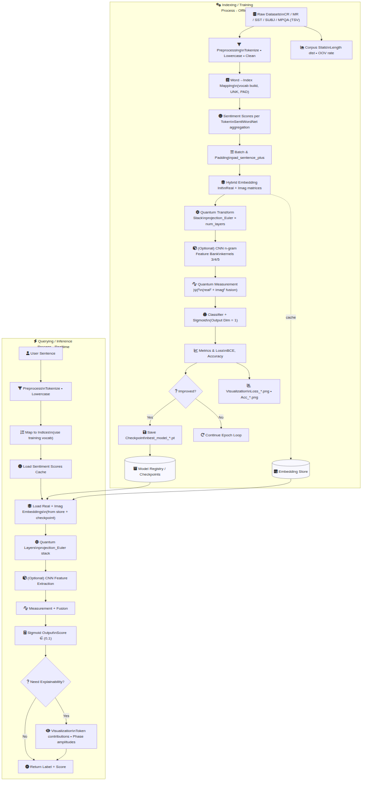

# Sinh ảnh PNG cho sơ đồ QITSA

## 1. Cài đặt Mermaid CLI
```bash
npm install -g @mermaid-js/mermaid-cli
```

## 2. Sinh ảnh cơ bản
```bash
mmdc -i docs/pipeline-overview.mmd -o docs/pipeline-overview.png --scale 1
```

## 3. Tăng độ nét (2x)
```bash
mmdc -i docs/pipeline-overview.mmd -o docs/pipeline-overview@2x.png --scale 2
```

## 4. Kiểm tra file
```bash
ls -la docs/pipeline-overview*.png
```

## 5. Commit thủ công
```bash
git add docs/pipeline-overview.mmd docs/pipeline-overview.png
git commit -m "Add QITSA pipeline diagram (PNG)"
git push origin pipeline-diagram
```

## 6. Script tự động (tuỳ chọn)
Tạo file `scripts/render-diagrams.sh`:
```bash
#!/usr/bin/env bash
set -euo pipefail
mmdc -i docs/pipeline-overview.mmd -o docs/pipeline-overview.png --scale 1
mmdc -i docs/pipeline-overview.mmd -o docs/pipeline-overview@2x.png --scale 2
echo "Rendered diagrams:"
ls -la docs/pipeline-overview*.png
```

Chạy:
```bash
bash scripts/render-diagrams.sh
```

## 7. Nhúng vào tài liệu
Trong bất kỳ markdown:
```markdown

```

## 8. Gợi ý CI (GitHub Actions)
Thêm workflow `render-diagrams.yml` trong `.github/workflows/`:
```yaml
name: Render Mermaid Diagrams
on:
  push:
    branches:
      - pipeline-diagram
    paths:
      - 'docs/*.mmd'
  workflow_dispatch:

jobs:
  render:
    runs-on: ubuntu-latest
    steps:
      - name: Checkout
        uses: actions/checkout@v4
      - name: Setup Node
        uses: actions/setup-node@v4
        with:
          node-version: '20'
      - name: Install mermaid-cli
        run: npm install -g @mermaid-js/mermaid-cli
      - name: Render diagrams
        run: |
          mmdc -i docs/pipeline-overview.mmd -o docs/pipeline-overview.png --scale 1
          mmdc -i docs/pipeline-overview.mmd -o docs/pipeline-overview@2x.png --scale 2
      - name: Commit rendered images
        run: |
          git config user.name "diagram-bot"
          git config user.email "diagram-bot@users.noreply.github.com"
          git add docs/pipeline-overview.png docs/pipeline-overview@2x.png
          if git diff --cached --quiet; then
            echo "No changes to commit."
          else
            git commit -m "Render pipeline diagram PNGs"
            git push origin pipeline-diagram
```
